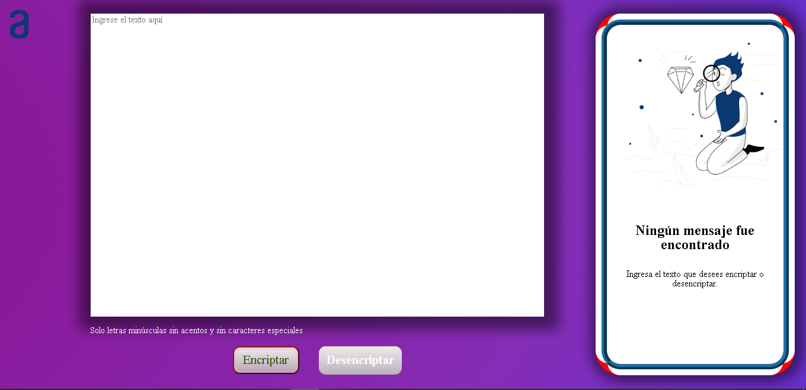

<div align="center">

 <h1>
 
 Encriptador de texto
 
 </h1>
 
 <h2>
  Web
 </h2>

  
 <!--
 
 
  -->
</div>

<details>
  <summary>Sumario</summary>
  <ol>
    <li>
      <a href="#descripción-del-proyecto">Descripción del proyecto</a>
    </li>
    <li><a href="#requisitos">Requisitos</a></li>
    <li><a href="#extra">Extra</a></li>
    <li><a href="#notas">Notas</a></li>
    <li>
      <a href="#tecnologías-usadas">Tecnologías usadas</a>
    </li>
    <li><a href="#web">Web</a></li>
    <li><a href="#redes-sociales">Redes sociales</a></li>
    <li><a href="#agradecimientos">Agradecimientos</a></li>
  </ol>
</details>

## Descripción del proyecto

Este repositorio contiene el código del primer desafío de Oracle Next Education, en el que se construyó una página web que encripta y desencripta texto ingresado por el usuario. El objetivo de este desafío es poner a prueba los conocimientos adquiridos durante la ruta "Principiante en programación".

## Requisitos

- La página web funciona solo con letras minúsculas.
- No se deben utilizar letras con acentos ni caracteres especiales.
- Es posible convertir una palabra para la versión encriptada y también devolver una palabra encriptada a su versión original.

Por ejemplo:

```
"tigre" => "timesgrenter"
"timesgrenter" => "tigre"
```
- La página tiene campos para inserción del texto que será encriptado o desencriptado, y el usuario puede escoger entre las dos opciones.
- El resultado es mostrado en la pantalla.

## Extra
- Un botón que copie el texto encriptado/desencriptado para la sección de transferencia, o sea que tenga la misma funcionalidad del ctrl+C o de la opción "copiar" del menú de las aplicaciones.

## Notas

- El código de este proyecto es solo para fines educativos y no debe ser utilizado para encriptar o desencriptar información confidencial.
- Es posible que el código contenga errores o mejoras necesarias, si deseas darme tu opinión o consejo escríbeme através de mis redes sociales.

## Tecnologías usadas

- JavaScript
- hTML
- CSS

## Web

Dirección: https://artoriasthewalkingabyss.github.io/Challenge-One-Oracle-Alura-Encriptador/

### Llaves de encriptación

La página web utiliza las siguientes llaves de encriptación:

- La letra "a" es convertida a "ai"
- La letra "e" es convertida a "enter"
- La letra "i" es convertida a "imes"
- La letra "o" es convertida a "ober"
- La letra "u" es convertida a "ufat"

## Redes Sociales

- [Linkedin](https://www.linkedin.com/in/agust%C3%ADn-castro-irb/)
- [Twitter](https://twitter.com/AgustinSmaug)

## Agradecimientos

 - [Alura Latam](https://www.aluracursos.com/)
 - [Oracle](https://www.oracle.com/ar/education/oracle-next-education/)
 - [Jeanmarie Quijada](https://www.linkedin.com/in/jeanmariequijada/?original_referer=https%3A%2F%2Fwww.aluracursos.com%2F)
 - [Génesys Rondón](https://www.linkedin.com/in/genesysrondon914762182/)

